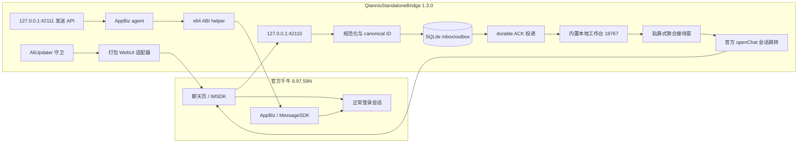

# 千牛独立消息桥逆向、实现与验收报告

> 日期：2026-08-14  
> 目标：脱离探域账号体系与运行链路，复用官方千牛的正常登录会话，把收到的消息立即投递到本机 127 工作台，并提供独立文本发送接口。  
> 状态：接收、去重、本地投递和文本发送均已完成真实标记验收。

## 1. 最终结论

`<repo-root>` 已独立运行在千牛 `9.97.59N` 上。在线链路不再依赖探域登录、探域进程、探域云接口、旧 `QianniuBridgeAgent.exe`、41010/41011 IPC、`InsidePlugin` 或 9.77 `qnmsgplugin`。

独立桥没有绕过千牛认证。操作者仍需在官方千牛正常登录；桥接器只复用该客户端已经建立的会话，不读取或替代服务端凭证。

真实验收结果：

| 链路 | 标记 | 唯一回执 | 结果 |
|---|---|---|---|
| 测试账号发给千牛 | `QN-IN-0814-1` | `4251518684333.PNM` | SQLite 仅 1 条，工作台已送达，重复 0，待投递 0 |
| 官方千牛 UI 手工发送 | `QN-OUT-0814-1` | `4257357342597.PNM` | `sendStatus=0`、进度 100、MessageSDK RPC 200 |
| 独立 AppBiz 适配器发送 | `QN-API-0814-1` | `4257405102294.PNM` | 仅 1 个消息 ID/客户端 ID，进度 100、RPC 200 |

入站事件从本地捕获到工作台 durable commit 约 39 ms；平台消息时间到本地捕获约 1.16 s。这个样本证明本地桥没有引入明显排队延迟，但平台到客户端的网络时间不受本桥控制。

## 2. 已实现架构



生产接收不依赖 CDP 注入。`browser_bridge.js` 被幂等写入两个运行时 `webui.zip`，页面启动后主动连接本机 WebSocket。IMSDK 事件是低延迟主路径，2 秒有限轮询只负责断线、休眠和漏事件恢复。

## 3. 接收、投递与去重

每条平台消息使用下列稳定主键：

```text
qn-msg-v1|taobao|<messageId>
```

事件在向页面 ACK 前写入 SQLite。投递器使用 `BEGIN IMMEDIATE` 原子执行 `pending -> sending`，只有工作台返回逐事件 durable ACK 后才进入 `delivered`。处于 `sending` 或 `delivered` 的同 ID 消息不能被实时回调、轮询结果或其他协议包装重新排队。

这直接修复了原始故障：同一个 `4255971304943.PNM / 0248` 曾从多个协议表面进入 UI，导致工作台显示两次。现在重复来源会在桥内归并成同一主键。

工作台仍应按 `event_id` upsert。这样可覆盖“工作台已提交、桥进程在本地标记 delivered 前退出”这一跨进程确认窗口。

### 内置工作台

版本 1.2.0 增加了独立的 `http://127.0.0.1:18767/` 工作台。它与接收桥运行在同一服务进程，直接从同一个 SQLite 事件表读取会话列表和正文，并把人工回复接到已验证的 AppBiz 发送入口。旧 `18766` 工作台可以继续为原系统运行，但不再接收本桥的新事件。

2026-08-14 22:28 的新进线正文在独立桥数据库与旧工作台状态文件中均完整存在；旧页面只显示提醒、没有主动选择会话。新工作台在首次加载时自动选择最新会话，并经浏览器截图确认完整显示正文“你好 2228”和消息 ID `4251640875008.PNM`。

### 贴靠式聚合接待与会话跳转

版本 1.3.0 恢复了探域“贴在千牛旁边的聚合消息列表”，但运行链路已完全替换。静态恢复确认探域点击消息时发送 `open_customer_dialog`，核心字段是店铺、买家 nick/ID、完整 `platformSessionId`、平台类型和 `appCid`。千牛 9.97 自带的 `test1/openChat.json` 与 `jssdk-qnability.js` 进一步证明官方等价入口是：

```javascript
QNAbilityCenter.ability.invoke({
  cmd: 'openChat',
  param: { nick: 'cntaobao<buyer-nick>' }
});
```

独立桥只允许打开已经存在于本地 SQLite 的会话。`POST /api/v1/open-conversation` 受工作台 token 保护，动态加载千牛官方 AbilityCenter JS 后调用 `openChat`，再轮询当前会话并要求实际 ccode 与目标完全一致。点击行不会发送消息，自动刷新和默认选择也不会触发打开。

`docked_workbench.py` 将 286 px 聚合窗贴在千牛接待中心右侧，空间不足时放到左侧。Win32 句柄签名已按 64 位声明；实测移动千牛 `(+20,+10)` 后，聚合窗从 `(1541,55)` 精确跟随到 `(1561,65)`。启动器会等待 `18767` 就绪，前端请求也有超时恢复，避免服务与窗口同时启动时偶发空列表。

最终 UI 自动化验收调用了显示 `<test-buyer> / 2325` 的真实聚合行，页面返回“已在千牛打开”，千牛当前会话与目标 ccode 一致。完整工作台同时显示该条入站正文和 10 条会话消息，解决了“有提醒但无详情”的问题；本次跳转验收没有发送任何消息。

## 4. 发送核心恢复

旧 9.77 `qnmsgplugin` 与当前 9.97 运行时不兼容，因此保持禁用。发送改为直接使用千牛 9.97 自身的 `AppBiz.dll`：

| 语义 | 9.97 位置 |
|---|---:|
| `CAppMessageService::SendTextMsg` | vtable 槽 18，RVA `0xA77FF0` |
| `CMessageBiz::SendTextMsg` | RVA `0xA59120` |
| `GroupSendTextMsg` | RVA `0xA4F4D0` |
| `CMessageBiz` 指针 | service 对象偏移 `0x578` |

官方 UI 标记发送观测到三个字符串参数长度为 `[41, 13, 168]`。哈希比对确认参数顺序是完整 ccode、正文、`pcsource`；第三个参数最终写入 metadata 的 `pcsource` 字段。

外层 `CAppMessageService` 包装器会无条件调用 Chromium `base::RepeatingCallback`，构造空 callback 不安全。因此 `appbiz_adapter.dll` 验证外层/内层 vtable 后，直接调用内部 `CMessageBiz::SendTextMsg`，并传入用同一 MSVC 工具链编译的真实空操作 `std::function` 回调。布局检查为：`std::string=32`、metadata=64、callback=64。

真实 API 验收只调用了一次适配器。结果为 `0`，随后日志得到消息 ID `4257405102294.PNM`、客户端 ID `7494020287592136741`、`sendStatus=0`、进度 100 和 `/r/MessageSend/sendByReceiverScope` RPC 200。验收工具在调用前写入不可重复 receipt，再次运行会因 receipt 已存在而拒绝。

## 5. 发送幂等与故障边界

发送接口需要 bearer token、完整 ccode、正文和永久唯一的 `request_id`。桥在调用原生函数之前，以 `BEGIN IMMEDIATE` 把请求原子写为 `in_flight`：

- 同一 `request_id` 与相同载荷再次提交，只返回原回执，不重新发送。
- 同一 `request_id` 与不同载荷会被拒绝。
- 已知拒绝写为 `rejected`；原生调用正常返回后写为 `completed`。
- 若进程在原生调用后、最终回执前退出，请求保留为 `in_flight`，自动重试被阻止。

最后一种情况无法仅靠客户端判断消息是否已到达服务端。宁可暴露“结果未知”交给人工核验，也不能自动重发并制造重复消息。

## 6. 运行态剥离

2026-08-14 已完成可回滚切换：

- 运行根位于 `<repo-root>\runtime\9.97.59N`。
- 探域进程、旧淘宝 9.77 运行树和旧消息桥数量为 0。
- 41010/41011 不再监听；独立工作台使用 `127.0.0.1:18767`，原 `18766` 服务保持不变。
- `AliUpdater` 持续禁用；每次启动都会幂等刷新 WebUI 注入。
- 独立 API 和 WebSocket 仅绑定 loopback。
- 不相关的拼多多进程不在本次范围内，未被停止。

最终在线状态为：桥版本 `1.3.0`、浏览器连接 1、IMSDK 已 hook、轮询错误 0、待投递 0、已送达 10、AppBiz ready、发送启用、内置工作台 1 个会话且无错误。ABI helper 按需加载，不在空闲时常驻 agent 状态。

## 7. 验证

```powershell
Set-Location <repo-root>
py -3.10 -m unittest discover -s tests -v
py -3.10 -m py_compile standalone_bridge.py
py -3.10 -m py_compile docked_workbench.py
node --check browser_bridge.js
node --check appbiz_agent.js
.\status.ps1
```

16 项自动化测试全部通过，覆盖：接收规范化、用户样本去重、已认领/已投递事件不可重排、观察模式、假网关 durable ACK、内置工作台正文读取与 durable claim ACK、聚合窗左右停靠、运行时残留扫描、WebUI 注入幂等、更新守卫、ABI 未验收拒绝、发送请求先落库、同请求回执复用和 `in_flight` 自动重试阻断。

关键产物 SHA-256：

| 文件 | SHA-256 |
|---|---|
| `standalone_bridge.py` | `321EA49D7C34FC4F383DBC48FB750F3CD0E9A00FCFF55BE02A73345D51BC83CA` |
| `docked_workbench.py` | `B5AE3547A76BEAD088AA15B5A906AFB42C006A5157FC33AF120F2AFC66A5E0D5` |
| `workbench.html` | `F6FA7F1A3B8FDC26925D8079108AA512015E2C1E08C3022498DC43550B77034E` |
| `browser_bridge.js` | `F01B9C0927A945B63FAE002F5B02D1636B8E7E086739205BD567E4A68C70B13F` |
| `appbiz_agent.js` | `5D2A2C9581E81C9BB7066AF2B230E0D18452B9C8B83BE0877D3D883474067AE9` |
| `native/appbiz_adapter.cpp` | `B8872360F3149641CC12E03E25E654CC17F3473D87ECAED40A7F39DB974A1E1A` |
| `build/appbiz_adapter.dll` | `0A9C90B33B0B0B999566934FABC2AF5CF9F6B1FC98C9FB28DB241A5D9128D058` |
| `notes/appbiz-send-recovery.json` | `B74DFE41B337FF1AF8DBAFEF3B3BEE1AEFCD2CC842BF028C10C6C48667FADDC1` |

## 8. 运维边界

1. 先启动官方千牛并正常登录，再运行 `start.ps1`。
2. 监控 `/api/v1/status` 的浏览器连接、IMSDK hook、AppBiz ready、pending 和 error 字段。
3. 发送调用方必须持久化并复用自己的 `request_id`，HTTP 超时不能换新 ID 自动重发。
4. 千牛版本升级后先停用发送，重新核验 AppBiz RVA、vtable 和一条受控回执，再恢复 `appbiz_send_abi_validated`。
5. 不要同时启用旧探域接收器，否则即使独立桥自身不重复，两个系统仍会分别向工作台投递。
6. 聚合窗只有在千牛或聚合窗处于前台时显示；关闭聚合窗后可重新运行 `start.ps1` 恢复。

## 9. 证据索引

- E-009 至 E-013：独立桥实现、去重、假网关、运行时剥离与切换。
- E-014、E-015：AppBiz 9.97 静态恢复、安全适配器和更新守卫。
- E-016：真实入站与官方 UI 出站标记验收。
- E-017：独立 AppBiz API 单次验收和发送幂等加固。
- E-018 至 E-020：探域聚合点击语义、千牛官方 `openChat` 边界、独立聚合窗与详情/跟随验收。
