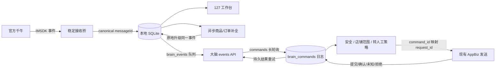

# 千牛大脑工作台协议还原与集成报告

> 日期：2026-08-15  
> 类型：逆向工程与本地集成，`flavor = null`  
> 目标：保留新桥稳定收发底座，迁移旧客户端的大脑连接、白盒诊断和上下文能力

## 执行摘要

旧 `QianniuBridgeAgent.exe` 的大脑协议已从 PyInstaller 内嵌模块中还原为五个 HTTP 接口，认证头、请求体和命令字段已在隔离测试服务上复现。新项目新增独立的大脑事件队列、工位注册与心跳、命令轮询与持久 ACK、跨重启命令幂等、续租兼容、店铺范围保护、安全文案拦截、转人工粘性、商品/订单 MTop 上下文补全，以及可直接配置令牌和地址的三栏白盒工作台。原有浏览器接收、SQLite 消息去重、AppBiz/MessageSDK 发送和吸附窗点击边界没有被替换。

真实大脑尚未联调，因为本次没有提供服务地址和工位令牌。当前配置中大脑保持关闭，未产生外部请求。

## 范围

授权和边界见 [2026-08-15_brain-workbench-scope.md](2026-08-15_brain-workbench-scope.md)。

| 对象 | SHA-256 |
|---|---|
| `QianniuBridgeAgent.exe` | `AD5EFCE1A228D9088853F8F3F1B22A8C83C452E56F21D8741FDC9DA05F33EFE6` |
| `LocalSeatGateway.exe` | `32907F53234ED9BA52009F7C2A0854F4E1527062EB7FACD40F67E0E653B4CC9A` |

## 还原结果

所有请求统一携带 `X-Agent-Token`、`X-Agent-Id` 和 `X-Device-Id`：

| 动作 | 方法与路径 | 主体 |
|---|---|---|
| 注册 | `POST /api/bridge/v1/register` | `agent_id`, `agent_name`, `version` |
| 心跳 | `POST /api/bridge/v1/heartbeat` | `agent_id`, `agent_name`, `status` |
| 事件 | `POST /api/bridge/v1/events` | `agent_id`, `events[]` |
| 拉命令 | `GET /api/bridge/v1/commands?agent_id=...&wait_seconds=...` | 无 |
| 命令结果 | `POST /api/bridge/v1/commands/{id}/result` | `agent_id`, `result` |

命令兼容 `id`/`command_id`、`type=send_text|open_chat`、`buyer_id`、`content`、`buyer_nick`、`meta` 和 `lease_token`。注册响应若签发 `agent_id`，新客户端会原子保存并在后续请求中使用。

## 集成架构



关键边界：

- 本地入库不等待大脑，离线时消息仍立即出现在工作台。
- 只有大脑已启用时新进入的事件才加入 `brain_events`，避免首次配置后触发历史 AI 回复。
- 已启用但临时离线的事件会留在 SQLite 中指数退避重试。
- `command_id` 先持久化，再映射为稳定的发送 `request_id`；重复下发不会再次调用千牛。
- 同一命令重新租赁时忽略变化的租约元数据，只更新结果中的最新租约，不再次调用千牛。
- AI 发送前执行旧版安全文案规则、服务端店铺范围和一小时转人工粘性；本地人工发送不受这些 AI 规则限制。
- `unknown` 发送状态不会自动重发。
- 远程 `open_chat` 默认关闭；主工作台点击会话不弹千牛，只有吸附窗人工点击保持跳转。

## 工作台能力

- 千牛接收/发送就绪状态和大脑注册/心跳状态。
- 大脑地址、令牌、工位 ID/名称、AI 回复和远程跳转开关。
- 令牌只接受写入，GET API 仅返回 `token_configured`，不会回传原文。
- 大脑事件待上报、已确认、命令待回执数量和最老待处理时间。
- 信号轨展示本地接收、大脑上报、命令执行、SDK 提交、最终确认和原始证据。
- 商品、订单、物流和上下文补全状态。
- 当前会话 `AI / 人工` 模式、自动转人工原因以及手动恢复入口。
- 完整运行状态 JSON，用于定位 IMSDK、AppBiz、队列和大脑错误。

设计约束见 `../.ulpi/design/DESIGN.md` 和 `../.ulpi/design/brain-workbench.md`。

## Evidence

### E-001

- `source_ref`: `tools/inspect_legacy_bridge.py` + 旧 `QianniuBridgeAgent.exe`
- `source_type`: file / command
- `content_hash`: `6818DD2B712E63BDDA693425A361A84644C734EEBD2CDB10BAA2BB7A2428F61F`
- `artifact_path`: `tools/inspect_legacy_bridge.py`
- `repro_command`: `py -3.10 tools\inspect_legacy_bridge.py <legacy-bridge-source>`
- `raw_excerpt`: 输出注册、心跳、事件、命令和结果五个路径及完整请求体。

### E-002

- `source_ref`: `tests/test_standalone.py`
- `source_type`: command
- `content_hash`: n/a
- `artifact_path`: n/a
- `repro_command`: `py -3.10 -m unittest discover -s tests -v`
- `raw_excerpt`: 37 项通过，覆盖协议、历史隔离、命令不重复、续租、安全/转人工策略、上下文解析和原收发回归。

### E-003

- `source_ref`: `state/verification/workbench-ui-report.json`
- `source_type`: screenshot / file
- `content_hash`: `AD13A9B8AF1F062A7F3F9A0B176AC71100F241498777E3B56E4D960695E260A3`
- `artifact_path`: `state/verification/`
- `repro_command`: `py -3.10 tools\verify_workbench_ui.py`
- `raw_excerpt`: 1440x900、1024x768、390x844、286x760 均无页面溢出，控制台错误为 0。

### E-004

- `source_ref`: `status.ps1`
- `source_type`: command
- `content_hash`: n/a
- `artifact_path`: n/a
- `repro_command`: `.\status.ps1`
- `raw_excerpt`: `ok=true`, `browser.connected=1`, `appbiz_send.ready=true`, `brain.enabled=false`。

## Findings

### F-001

- `title`: 旧大脑协议已完整还原
- `severity`: `n/a_re`
- `category`: `reverse_algo`
- `status`: `validated`
- `evidence_ids`: `[E-001, E-002]`
- `location`: `bridge.client` / `BrainConnector`
- `impact`: 新客户端可兼容旧后端，无需保留旧 EXE、探域进程或旧消息通道。
- `confidence`: `high`

### F-002

- `title`: AI 命令具备跨重启幂等保护
- `severity`: `n/a_re`
- `category`: `design`
- `status`: `validated`
- `evidence_ids`: `[E-002]`
- `location`: `StateDB.brain_commands`, `BrainConnector.handle_command`
- `impact`: 后端重复命令或 ACK 丢失不会造成同一回复二次发送。
- `confidence`: `high`

### F-003

- `title`: 本地优先与大脑队列相互独立
- `severity`: `n/a_re`
- `category`: `design`
- `status`: `validated`
- `evidence_ids`: `[E-002, E-004]`
- `location`: `StateDB.brain_events`, `StandaloneBridge.ingest_event`
- `impact`: 大脑延迟或故障不阻塞 127 工作台；启用前历史事件不会触发 AI。
- `confidence`: `high`

### F-004

- `title`: 白盒覆盖关键链路和响应式场景
- `severity`: `n/a_re`
- `category`: `other`
- `status`: `validated`
- `evidence_ids`: `[E-003, E-004]`
- `location`: `workbench.html`
- `impact`: 无需查日志即可定位千牛、大脑、事件队列、命令和发送回执状态。
- `confidence`: `high`

### F-005

- `title`: 旧版 AI 策略层已迁移且不影响人工发送
- `severity`: `n/a_re`
- `category`: `design`
- `status`: `validated`
- `evidence_ids`: `[E-001, E-002]`
- `location`: `outbound_safety_result`, `session_controls`, `BrainConnector.execute_command`
- `impact`: 危险文案、越权店铺和转人工会话不会进入 AI 发送链路；命令续租也不会造成重复发送。
- `confidence`: `high`

## Path

### P-001

- `title`: 买家消息到 AI 回复的调用流
- `path_type`: `callflow`
- `start`: 千牛 `onReceiveNewMsg`
- `goal`: 大脑回复经 MessageSDK 提交并回传持久结果
- `steps`:
  1. 接收桥按平台 `messageId` 写 SQLite。`evidence: E-002`, `finding: F-003`
  2. 上下文工人在独立线程原地补全商品/订单。`evidence: E-002`
  3. `brain_events` 向旧 `/events` 协议投递并等待 ACK。`evidence: E-001`, `finding: F-001`
  4. 大脑命令按 `command_id` 先入日志，经安全、店铺范围和转人工策略后再调用现有发送函数。`evidence: E-002`, `finding: F-002, F-005`
  5. 结果持久化并重试上报，信号轨展示全链。`evidence: E-003`, `finding: F-004`
- `residual_risks`: 真实大脑部署版本和令牌尚未联调；千牛 MTop 返回结构可能随版本变化，解析器采用结构化容错并保持非阻塞。

## Timeline

| 时间 | 事件 |
|---|---|
| 2026-08-15 | 提取旧 PyInstaller 模块，确认协议和命令字段 |
| 2026-08-15 | 新增大脑队列、注册心跳、命令日志和 ACK |
| 2026-08-15 | 新增商品/订单异步补全与白盒信号轨 |
| 2026-08-15 | 37 项测试和四种视口自动化通过 |

## 使用与验证

1. 打开 `http://127.0.0.1:18767/`，点击“设置”。
2. 输入大脑地址和本机专用工位令牌，开启“连接大脑”和“AI 自动回复”。
3. 点“测试连接”，成功后保存。
4. 用测试买家发一条新消息，核对大脑只收到一次事件。
5. 由大脑下发唯一 `command_id` 的回复命令，核对千牛只产生一条消息。
6. 在会话顶部切到“人工”，确认 AI 命令被拦截而工作台手动发送仍可用，再切回“AI”。

```powershell
Set-Location <repo-root>
.\status.ps1
py -3.10 -m unittest discover -s tests -v
py -3.10 tools\verify_workbench_ui.py
```

不使用真实买家做首次联调。重复测试同一命令时必须复用相同 `command_id`。
